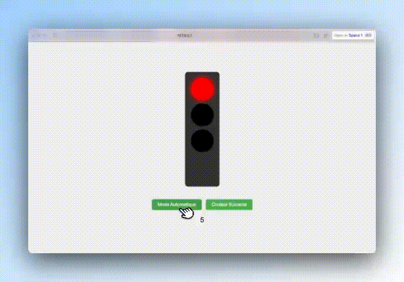

## 🎥 Démonstration du Projet par JoPad 🚦



---

# Projet : Feu Tricolore Interactif

## Objectif
Créer un feu tricolore interactif en HTML, CSS et JavaScript.

---

## Description du projet
Le projet consiste à créer un feu de circulation avec trois lumières (rouge, orange, vert) :  
- Les lumières changent automatiquement toutes les 2 secondes.  
- Un bouton permet de basculer entre le mode automatique et le mode manuel.  
- En mode manuel, un autre bouton permet de changer la couleur active.

---

## Fonctionnalités attendues

### 1. HTML
- Un feu de circulation avec trois cercles pour représenter les lumières (rouge, orange, vert).  
- Deux boutons :
  - **"Mode Automatique"** pour activer/désactiver le changement automatique des lumières.
  - **"Couleur Suivante"** pour passer à la lumière suivante en mode manuel.

### 2. CSS
- Les cercles doivent ressembler à un vrai feu tricolore (avec des couleurs et des transitions).  
- Ajouter un style visuellement agréable pour les boutons et le feu.

### 3. JavaScript
- Implémenter un mode automatique où les lumières changent toutes les 2 secondes (rouge -> orange -> vert -> rouge).  
- Permettre à l'utilisateur de basculer entre le mode automatique et manuel.  
- En mode manuel, l'utilisateur doit pouvoir changer les lumières en cliquant sur le bouton "Couleur Suivante".

---

## Organisation du travail

### **Jour 1 : Structure HTML et CSS**
1. Créez une structure HTML avec un conteneur pour le feu tricolore (rouge, orange, vert).
2. Stylisez le feu de circulation avec CSS (formes, couleurs, alignement).

### **Jour 2 : Logique du jeu avec JavaScript**
1. Ajoutez la logique pour le mode automatique avec `setInterval`.  
2. Permettez à l'utilisateur de basculer entre le mode automatique et manuel.  
3. Implémentez le bouton "Couleur Suivante" pour le mode manuel.

---

## Exemple de rendu

### Structure initiale (HTML)
```html
<div class="traffic-light">
  <div class="light red active"></div>
  <div class="light orange"></div>
  <div class="light green"></div>
</div>
<button id="toggle-mode">Activer/Désactiver Mode Automatique</button>
<button id="next-color" disabled>Passer à la couleur suivante</button>
```

### Exemple CSS pour les lumières
```css
.traffic-light {
  width: 100px;
  margin: auto;
  background: #333;
  padding: 10px;
  border-radius: 10px;
  display: flex;
  flex-direction: column;
  gap: 10px;
}
.light {
  width: 50px;
  height: 50px;
  background: gray;
  border-radius: 50%;
  margin: auto;
  transition: background 0.5s;
}
.light.red.active { background: red; }
.light.orange.active { background: orange; }
.light.green.active { background: green; }
```

---

## Bonus pour les élèves avancés
1. Ajouter un compteur de temps pour chaque lumière (par exemple : rouge pendant 5 secondes, orange pendant 2 secondes).  
2. Ajouter des animations supplémentaires comme un clignotement avant de passer au rouge.  
3. Améliorer le design du feu de circulation en ajoutant un cadre ou un poteau.

---

## Fichiers attendus
- **index.html** : Structure du feu tricolore et des boutons.  
- **style.css** : Style des lumières et de la mise en page.  
- **script.js** : Logique pour les modes automatique et manuel.

---

## Livrables
- Une archive ZIP contenant les fichiers HTML, CSS et JavaScript.  
- Un projet fonctionnel avec des commentaires dans le code JS expliquant votre logique.